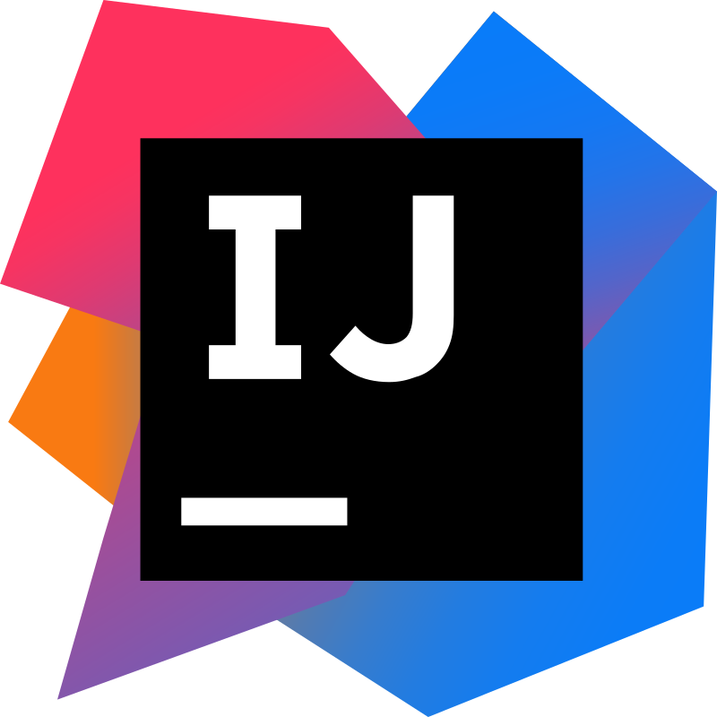

<h1 align="center">
  
</h1>

 

  🎓 University of Texas at Dallas
   
  ✈ Lockheed Martin Sensor Fusion
   
  💻 I make cool stuff.

<<<<<<< Updated upstream
=======
 
>>>>>>> Stashed changes

<h2 align="center">Languages and Tools</h2>

<<<<<<< Updated upstream
  <code></code>

=======
    <code></code>
    <code></code>
    <code></code>
    <code></code>

 
>>>>>>> Stashed changes

  Contact:
   

<<<<<<< Updated upstream
=======
 

<h2 align="center">Tools</h2>

  <code></code>
  <code></code>
  <code></code>
  <code></code>

 
>>>>>>> Stashed changes
